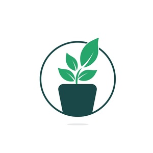

<!--suppress HtmlDeprecatedAttribute -->
<div id="top"></div>

[![MIT License][license-shield]][license-url]
[![Stargazers][stars-shield]][stars-url]



<details open>
    <summary>Table of Contents</summary>
    <ol>
        <li>
            <a href="#about">About The Project</a>
            <ul>
                <li><a href="#endpoints">Implemented Endpoints</a></li>
                <li><a href="#built">Build With</a></li>
            </ul>
        </li>
        <li>
            <a href="#start">Getting Started</a>
            <ul>
                <li><a href="#install">Installation</a></li>
                <li><a href="#mosquitto">Mosquitto</a></li>
                <li><a href="#storm-glass">Storm Glass API</a></li>
                <li><a href="#test">Testing</a></li>
            </ul>
        </li>
    </ol>
</details>

<div id="about"></div>

## About The Project

Our application is a prototype for an IoT device, which implements a smart plant care system.The system aims to adjust the water, light, or temperature of the plants, depending on certain parameters set by the user or
parameters that are updated based on weather-related information.


<div id="endpoints"></div>

### Implemented Endpoints:
#### Login
#### Register

#### System temperature 
* The user can set a temperature for the system
* The user can receive information about the system temperature

#### Soil Moisture
* The user can set the soil moisture
* The user can receive information about the soil moisture

#### Water
* The user can water a plant
* The user can receive information about watering the plants

#### Weather API
* The user can receive detailed information about the weather

Full API documentation can be found [here](Documentation.md)

<p align="right">(<a href="#top">back to top</a>)</p>


<div id="built"></div>

### Built With


* [Flask](https://flask.palletsprojects.com/en/2.0.x/)
* [Mosquitto](https://mosquitto.org/documentation/)


<p align="right">(<a href="#top">back to top</a>)</p>


<!-- GETTING STARTED -->
<div id="start"></div>

## Getting Started


You should have [python3](https://www.python.org/download/releases/3.0/) installed and [pip3](https://www.activestate.com/resources/quick-reads/how-to-install-and-use-pip3/). 
In order to run the project locally you should go through the following steps:

<div id="install"></div>

### Installation

1. cd into this project  

2. Install venv if not already installed:  
```sh
pip install virtualenv
```

  
3. Create an environment:  
```sh
python3 -m venv ./
```

  
Windows: 
```sh
python -m venv venv
```


4. Activate environment  

macOS/Linux:  
```sh
source venv/bin/activate
```


Windows:  
```sh
venv\Scripts\activate.bat
```


5. Install libraries
```sh
pip install -r requirements.txt
```


6. Set environment value for development:
```sh
export FLASK_ENV=development
```


CMD:
```sh
set FLASK_ENV=development
```


PowerShell:
```sh
$env:FLASK_ENV = "development"
```


7. Initialize (or reinitialize) database:  
```sh
flask init-db
```
8. Run  

```sh
flask run
```

<p align="right">(<a href="#top">back to top</a>)</p>

<div id="mosquitto"></div>

### Mosquitto 

Install and run [mosquitto](https://mosquitto.org/download/).

Mac

1. 
```sh
brew install mosquitto
```
3. If restarting the service is needed: 
```sh
brew services restart mosquitto
```

<p align="right">(<a href="#top">back to top</a>)</p>

<div id="storm-glass"></div>

### Storm Glass API 

In order to collect data about weather, we used The Storm Glass API, which allows you to fetch weather data for any coordinate on the globe in a simple, programmatic way using conventional HTTP requests. When a request is successful, a response will be sent back in the form of a JSON object.
The weather request is used to fetch weather data for a point. The Storm Glass API provides marine weather as well as global weather for land and lakes.

Point Requests are used to retrieve data for a single coordinate.

```sh
https://api.stormglass.io/v2/weather/point
```
You can read more about the required parameters and the response format [here](https://docs.stormglass.io/?_gl=1*1hkz7yn*_ga*MTcyNzk0ODA3OS4xNjM2OTE4ODk2*_ga_79XDW52F27*MTYzNjkxODg5Ni4xLjAuMTYzNjkxODkwOC4w&_ga=2.44520877.823273569.1636918896-1727948079.1636918896#/weather)

<p align="right">(<a href="#top">back to top</a>)</p>

<div id="test"></div>

### Testing 

To run the tests:
```sh
python -m pytest -v -W ignore::DeprecationWarning
```

<p align="right">(<a href="#top">back to top</a>)</p>


[license-shield]: https://img.shields.io/github/license/AlexandruMihai22/Proiect-Inginerie-Software?style=for-the-badge
[license-url]: https://github.com/AlexandruMihai22/Proiect-Inginerie-Software/blob/master/LICENSE.md
[stars-shield]: https://img.shields.io/github/stars/AlexandruMihai22/Proiect-Inginerie-Software?style=for-the-badge
[stars-url]: https://github.com/AlexandruMihai22/Proiect-Inginerie-Software/stargazers
